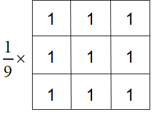

<center><font face="黑体" size="7">图像均值滤波和拉普拉斯图像增强实验报告</font></center>


<center>
    <font face="楷体" size="5">姓名：欧翌昕</font>
</center>

<center>
    <font face="楷体" size="5">专业：软件工程</font>
</center>


<center>
    <font face="楷体" size="5">学号：3190104783</font>
</center>

<center>
    <font face="楷体" size="5">课程名称：图像信息处理</font>
</center>
<center>
    <font face="楷体" size="5">指导老师：宋明黎</font>
</center>


<center>
    </font><font face="黑体" size="5">2020~2021秋冬学期 2020 年 12 月 18 日</font>
</center>

---


## 1 实验目的和要求

1. 图像均值滤波
2. 拉普拉斯图像增强

---


## 2 实验内容和原理

### 2.1 图像均值滤波

​		滤波器是一个大小为$M\times N$的窗口，窗口中的元素与原图像的处于窗口内的像素进行某种运算，结果作为新图像的一个像素。当窗口滑过原图像并完成上述运算之后，就能够得到一幅新图像。滤波器子图像中的值是系数值，而不是像素值，它代表了影响新像素产生的权重。

​		在待处理图像中逐点移动滤波掩模，在每一点$(x, y)$处，滤波器在该点的响应通过实现定义的关系来计算。对于线性空间滤波，其响应由滤波器系数与滤波掩模扫过区域的对应像素值的乘积之和给出。

​		通常，掩模的长宽都为奇数。假设分别为$2a+1$和$2b+1$。当窗口中心处于像素(*x*,*y*)处时，新的像素值为：
$$
g(x,y)=\sum^a_{s=-a}\sum^b_{t=-b}w(s,t)f(x+s,y+t)
$$
​		对图像$f$中所有像素都与掩模进行运算之后，最终产生一幅新图像$g$。

​		平滑线性空间滤波器的输出是包含在滤波掩模邻域内像素的简单平均值。因此，这些滤波器也称为均值滤波器。均值滤波器的主要应用是去除图像中的不相干细节，即那些与滤波掩模尺寸相比更小的像素区域。

​                      

​		简单平均表示窗口中每一个像素对响应的贡献是一样的；加权平均表示窗口中的像素对相应的贡献有大小之分。两个3×3平滑（均值）滤波器掩模，每个掩模前边的乘数等于它的系数值的和，以计算平均值。
$$
g(x,y)=\frac{\sum^a_{s=-a}\sum^b_{t=-b}w(s,t)f(x+s,y+t)}{\sum^a_{s=-a}\sum^b_{t=-b}w(s,t)}
$$

### 2.2 拉普拉斯图像增强

​		微分算子是实现锐化的工具，其响应程度与图像在该点处的突变程度有关。微分算子增强了边缘和其他突变（如噪声）并削弱了灰度变化缓慢的区域。通过拉普拉斯算子可以实现基于二阶微分的图像增强。

​		在$x$方向上对二阶偏微分采用下列定义：
$$
\frac{\partial^2f}{\partial x^2}=f(x+1,y)+f(x-1,y)-2f(x,y)
$$
​		在$y$方向上对二阶偏微分采用下列定义：
$$
\frac{\partial^2f}{\partial y^2}=f(x,y+1)+f(x,y-1)-2f(x,y)
$$
​		因此，拉普拉斯算子为：
$$
\nabla^2f=f(x+1,y)+f(x-1,y)+f(x,y+1)+f(x,y-1)-4f(x,y)
$$
​		再将对角线上的元素考虑进来设计掩膜，最终拉普拉斯算子为：
$$
\nabla^2f=f(x-1,y-1)+f(x,y-1)+f(x+1,y-1)\\
+f(x-1,y)+f(x,y)+f(x+1,y)\\
+f(x-1,y+1)+f(x,y+1)+f(x+1,y+1)-8f(x,y)
$$


​		当拉普拉斯滤波后的图像与其它图像合并时（相加或相减），则必须考虑符号上的差别。

​		将原始图像和拉普拉斯图像叠加在一起的简单方法可以保护拉普拉斯锐化处理的效果，同时又能复原背景信息。

---


## 3 实验步骤和分析

### 3.1 图像均值滤波

​		先将图像转换成灰度图像，然后设定3*3的滤波掩模，中间像素的值为九个像素值的平均，在图像中逐点移动滤波掩模，注意点是循环边界以及每次循环的循环变量的增量，代码实现如下：

```c
    for (i = 0; i < h-2; i++)
	{
		for (j = 0; j < w*3-skip-6; j += 3)
		{
			int t = i*bytesPerLine + j;

            int Y = (data[t]+data[t+3]+data[t+6]
            +data[t+bytesPerLine]+data[t+bytesPerLine+3]+data[t+bytesPerLine+6]
            +data[t+2*bytesPerLine]+data[t+2*bytesPerLine+3]+data[t+2*bytesPerLine+6])/9;
			
            data[t] = data[t+1] = data[t+2] = (BYTE)Y; 
		}
	}
```

### 3.2 拉普拉斯图像增强

​		先将图像转换成灰度图像，然后设定3*3的滤波掩模，根据公式计算中间像素的像素值，在图像中逐点移动滤波掩模，最后将拉普拉斯滤波后的图像与其它图像合并，并重新调整Y值到0到255之间，代码实现如下：

```c
    for (i = 0; i < h-2; i++)
	{
		for (j = 0; j < w*3-skip-6; j += 3)
		{
			int t = i*bytesPerLine + j;

            int lap = data[t]+data[t+3]+data[t+6]
                +data[t+bytesPerLine]+data[t+bytesPerLine+6]
                +data[t+2*bytesPerLine]+data[t+2*bytesPerLine+3]+data[t+2*bytesPerLine+6]
                -8*data[t+bytesPerLine+3];

            int pix = data[t]+abs(lap);

            if (pix > 255) data[t] = data[t+1] = data[t+2] = 255;
            else if (pix < 0) data[t] = data[t+1] = data[t+2] = 0;
            else data[t] = data[t+1] = data[t+2] = (BYTE)pix;
		}
	}
```

---


## 4 实验结果

### 4.1 原始图像


### 4.2 灰度图像


### 4.3 均值滤波结果图像


### 4.4 拉普拉斯增强结果图像


---


## 5 心得体会

​		通过这次实验，我更好的掌握了对BMP文件格式图像的操作方法，同时对图像均值滤波和拉普拉斯图像增强有了更直观的认识。同时也思考了一些老师上课时提到过的问题，当然也有很多地方还存在不足，例如代码复用率过高以及只实现了灰度图的图像均值滤波和拉普拉斯图像增强。本次实验中的滤波掩模的操作与实验二中的结构元有很大的相似之处，因此代码实现有很多共同之处，比如循环边界的控制等。
