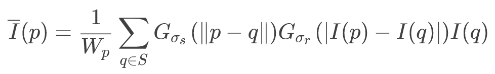
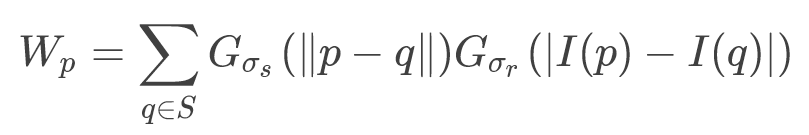
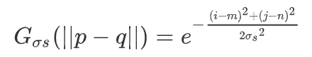
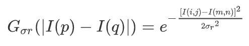

<center><font face="黑体" size="7">图像双边滤波实验报告</font></center>


<center>
    <font face="楷体" size="5">姓名：欧翌昕</font>
</center>
<center>
    <font face="楷体" size="5">专业：软件工程</font>
</center>

<center>
    <font face="楷体" size="5">学号：3190104783</font>
</center>

<center>
    <font face="楷体" size="5">课程名称：图像信息处理</font>
</center>


<center>
    <font face="楷体" size="5">指导老师：宋明黎</font>
</center>


<center>
    </font><font face="黑体" size="5">2020~2021秋冬学期 2020 年 12 月 30 日</font>
</center>
---


## 1 实验目的和要求

- 图像双边滤波

---


## 2 实验内容和原理

​		双边滤波是一种非线性滤波器，它可以达到保持边缘、降噪平滑的效果。和其他滤波原理一样，双边滤波也是采用加权平均的方法，用周边像素亮度值的加权平均代表某个像素的强度，所用的加权平均基于高斯分布。

​		最重要的是，双边滤波的权重不仅考虑了像素的欧氏距离（如普通的高斯低通滤波，只考虑了位置对中心像素的影响），还考虑了像素范围域中的辐射差异（例如卷积核中像素与中心像素之间相似程度、颜色强度，深度距离等），在计算中心像素的时候同时考虑这两个权重。

​		双边滤波的公式：



​		其中$W_p$表示为：



​		双边滤波中有两个衡量图像信息的核心变量，如上式中的$G_{σ_s}$为空间域核，$G_{σ_r}$为图像像素域核。空间域核是二维高斯函数，可以把它视作高斯滤波，像素域核就是衡量像素变化剧烈程度的量。将这两个变量相乘，就可以得到他们俩共同作用的结果：在图像的平坦区域，像素值变化很小，对应的像素范围域权重接近于1，此时空间域权重起主要作用，相当于进行高斯模糊；在图像的边缘区域，像素值变化很大，像素范围域权重变大，从而保持了边缘的信息。

​		空间域核的计算方法为：



​		像素域核的计算方法为：



​		在上面两个式子中，$σ_s$与$σ_r$都是已知的，或者说是自己输入的预设值，而其他的$i,j,m,n$都是需要在遍历中确定的值。其中$(i，j)$代表是窗口中心值，$(m，n)$代表的是滑动窗口中的某个值。

---


## 3 实验步骤和分析

​		图双边滤波的过程如下：

​		读取原始图像。

```c
BITMAPFILEHEADER fileHeader;  //位图文件头
BITMAPINFOHEADER infoHeader;  //位图信息头
FILE* pic1= fopen(input, "rb");  //打开输入文件
if (pic1 == NULL)
{
    printf("Open file failed!\n");
    exit(-1);
}
 
fread(&fileHeader, sizeof(BITMAPFILEHEADER), 1, pic1);  //读取文件头
fread(&infoHeader, sizeof(BITMAPINFOHEADER), 1, pic1);  //读取信息头
WORD bitCount = infoHeader.biBitCount;  //颜色位数
if (bitCount != 24)
{
    printf("Only 24 bit color map is allowed!\n");
    exit(-1);
}

LONG w = infoHeader.biWidth;    //图像数据的宽度
LONG h = infoHeader.biHeight;   //图像数据的高度
    
int bytesPerLine = ((w * bitCount+31)>>5)<<2;  //行数据大小
int imageSize = bytesPerLine*h;  //图像数据大小
int skip = 4-((w * bitCount)>>3)&3;  //需跳过的字节
    
BYTE* data = (BYTE*)malloc(imageSize);  //申请存储图像数据的空间
fread(data, imageSize, 1, pic1);  //记录图像数据
```


​		设定半径大小，设定空间函数方差和相似函数方差，分别计算空间权重以及相似权重。

```c
int r = 7;
 
double sigma_s = 1000;  //空间函数方差
double sigma_r = 10;    //相似函数方差
double s_coef = 0.5/(sigma_s*sigma_s);
double r_coef = 0.5/(sigma_r*sigma_r);
 
double s_w[200][200];  //空间权重
double r_w[256];       //相似权重

int i, j;

//计算空间权重
for(i = -r; i <= r; i++)
{
    for(j = -r; j <= r; j++)
    {
        int x = i+r;
        int y = j+r;
        s_w[x][y] = exp(-(i*i+j*j)*s_coef);
    }
}

//计算相似权重
for(i = 0; i < 256; i++)
{
    r_w[i] = exp(-i*i*r_coef);
}
```


​		根据空间权重以及相似权重计算出复合权重作为特征值。将每一点的特征值与该点像素值乘积相加，除以所有特征值的和，得到的结果即作为该点的像素值。

```c
//双边滤波
int k, m, n;
for (i = 0; i < h; i++)
{
	for (j = 0; j < w; j++)
	{
	    for (k = 0; k < 3; k++)
        {
            double weightSum = 0, dataSum = 0;
 
            for ( m = -r; m <= r; m++)
            {
                for (n = -r; n <= r; n++)
                {
                    if (m * m + n * n > r * r) continue;
                        
                    int H = i + m;
                    int W = j + n;

                    if (H < 0) H = 0;
                    if (H > h-1) H = h-1;
                    if (W < 0) W = 0;
                    if (W > w-1) W = w-1;

                    int d = abs(data[H*3*w+W*3+k]-data[i*3*w+j*3+k]);

                    double weight = s_w[m+r][n+r]*r_w[d];   //复合权重
                    dataSum += data[H*3*w+3*W+k]*weight;
                    weightSum += weight;
                }
            }
            double final = dataSum/weightSum;
            data[i*3*w+j*3+k] = (BYTE)final;
	    }
	}
}
```

---


## 4 实验结果

### 4.1 原始图像


### 4.2 灰度图像


### 4.3 双边滤波结果图像


---


## 5 心得体会

​		通过比较灰度图像与双边滤波结果图像，我们可以发现，双边滤波结果图像中的噪点减少了许多，整幅图像看起来更加平滑细腻。但本次实验中依然存在一些问题，比如未在RGB三个通道上均进行双边滤波操作，而只是实现了灰度图像的双边滤波。除此之外，有关于系数$σ_s$与$σ_r$的选取，也会对结果图像效果造成较大影响，若将$σ_s$与$σ_r$设置大些，结果图像会比较模糊，丢失细节信息。总体来说，通过本次实验，我对图像双边滤波有了更清晰的认识，在对权重的处理上也有了自己的思考，收获很大。

